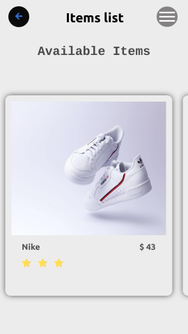
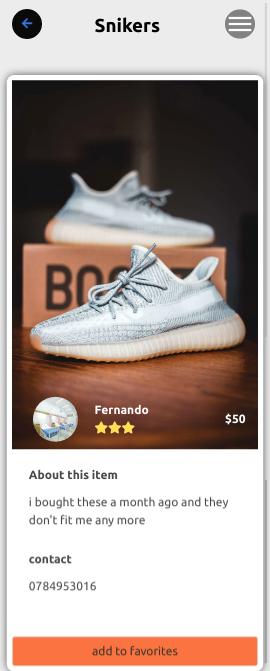
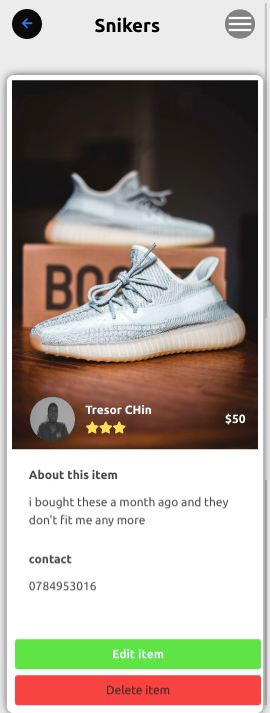
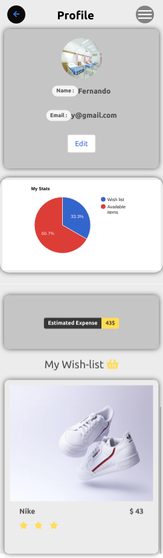
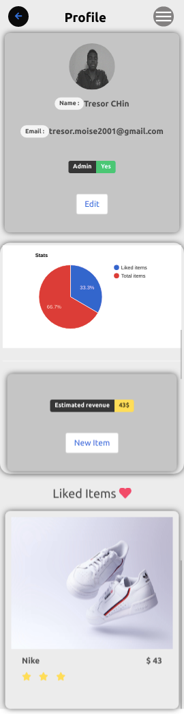
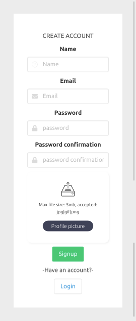

# Resell-app

### This project is a single page application built with React,Redux and Rails

#### This application is a resell-app where users can sell or buy partially used items for an affordable price.

## RoR API Endpoint

https://github.com/Tresor11/final-capstone-api

## Screenshots and Walkthrough

https://www.loom.com/share/9b3e28f9973d4148bc7359015e93704e

> The home page is a list of the available items from which a user can select a specific on to the it details and add it to your wish list.

 

> When vited by a normal user The Details page contains details of a specific item such as contacts, description,price,and full picture and the botton there is a button to add it to your wish list.

 

> When vited by an admin The Details page contains Show two additional buttons allowing the admin to edit or delete an item.

 

> The profile page contains all the details fo the user including:

> - the items on their wish list
> - their estimated expenses

> the user can also edit their profile informations

 

> The admin profile page has an addtional sections allowin the admin to:
> - create an new item
> - see the estimated revenue
> - see all the liked items

 

> The remaining pages are basically the welcome page and the different forms

 

## Built With

- javaScript
- React
- Rails
- Sass
- Bulma
- Redux
- Node js
- Heroku

## Live Demo

[Live Demo Link](https://resell-app.netlify.app/)

## Getting Started

Here are the steps to follow in order to get this project on your local computer.

### Prerequisites

`node v12.16.3 +`

`npm v6.14.4 +`

### Setup

clone this repo by typing `git clone`

### Install

install the dependacies by typing `npm install`

### Usage

start the local server by running `npm start`

### Deployment

this project is deployed on netlify

to get the deployment build of the code run `npm run build`

### Testing

this project uses jest from testing , to run the tests type `npm test` 

## Authors

👤 **Tresor bireke**

- Github: [@Tresor11](https://github.com/Tresor11)
- Twitter: [@Tbireke](https://twitter.com/Tbireke)

## 🤝 Contributing

Contributions, issues and feature requests are welcome!

Feel free to check the [issues page](issues/).

## Show your support

Give a ⭐️ if you like this project!

## Acknowledgments

- Hat tip to anyone whose code was used
- Inspiration
- etc

## 📝 License

This project is [MIT](lic.url) licensed.

