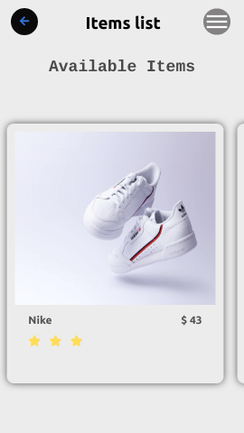
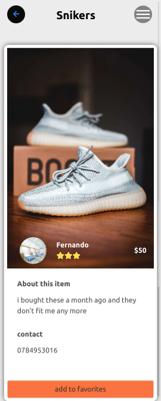

# Resell-app 

### This project is a single page application built with react,redux and rails

#### The application resell-app where users can sell or the buy partally used items for an affordable price

> The home page is a list of the available items from which you can select a specific on to the it details an add it to your wish list.

> The Details page contains details of a specific item such as contacts, description,price,and full picture and the botton there is a button to add it to your wish list.

> The profile page contains all the details fo the user such as their wish list, their name and email.it also has a button allowing the user to update their informations

> The remaining two pages are basically the welcome page and the different forms

## Built With

- javaScript
- React
- Rails
- Sass
- Bulma
- Redux
- Node js
- Heroku

## Live Demo

[Live Demo Link](https://resell-app.netlify.app/)

## Getting Started

Here are the steps to follow in order to get this project on your local computer.

### Prerequisites

`node v12.16.3 +`

`npm v6.14.4 +`

### Setup

clone this repo by typing `git clone`

### Install

install the dependacies by typing `npm install`

### Usage

start the local server by running `npm start`

### Deployment

this project is deployed on netlify

to get the deployment build of the code run `npm run build`

### Testing

this project uses jest from testing , to run the tests type `npm test` 

## Authors

👤 **Tresor bireke**

- Github: [@Tresor11](https://github.com/Tresor11)
- Twitter: [@Tbireke](https://twitter.com/Tbireke)

## 🤝 Contributing

Contributions, issues and feature requests are welcome!

Feel free to check the [issues page](issues/).

## Show your support

Give a ⭐️ if you like this project!

## Acknowledgments

- Hat tip to anyone whose code was used
- Inspiration
- etc

## 📝 License

This project is [MIT](lic.url) licensed.

